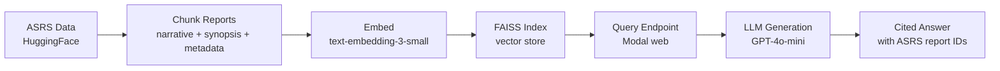

# AeroGraph

**Ask natural language questions about 47,000+ aviation safety incidents. Get cited answers from real NASA ASRS data.**

AeroGraph is a RAG (Retrieval-Augmented Generation) system built on NASA's [Aviation Safety Reporting System](https://asrs.arc.nasa.gov/) database. It embeds and indexes voluntary incident reports filed by pilots, controllers, mechanics, and flight attendants — then answers free-text queries with source-cited responses referencing specific ASRS report IDs.

Deployed as a serverless endpoint on [Modal](https://modal.com).

## Why This Matters

On January 29, 2025, PSA Airlines Flight 5342 collided with a Black Hawk helicopter on approach to Reagan National Airport. Sixty-seven passengers and four crew members were killed. The NTSB's final report, released in February 2026, found that the FAA had documented over 15,000 close-proximity events between helicopters and commercial aircraft at DCA alone. The warning data existed for decades — it was never systematically analyzed.

AeroGraph makes pattern discovery across aviation safety data instant and accessible. Safety analysts, researchers, and regulators can query decades of incident reports in natural language instead of searching NASA's legacy database interface one record at a time.

## Architecture



## Quick Start

```bash
# Clone
git clone https://github.com/YOUR_USERNAME/aerograph.git
cd aerograph

# Install dependencies
pip install -r requirements.txt

# Set up Modal (one-time)
modal setup

# Configure secrets (OpenAI API key)
modal secret create openai-secret OPENAI_API_KEY=sk-...

# Run the pipeline — loads data, chunks, embeds, builds index
modal run pipeline.py

# Deploy the endpoint
modal deploy app.py

# Query it
curl -X POST https://YOUR_MODAL_URL/query \
  -H "Content-Type: application/json" \
  -d '{"question": "What are common causes of runway incursions at major airports?"}'
```

## Example Queries

| Question | What AeroGraph surfaces |
|----------|------------------------|
| *"What are the most reported human factors in approach-phase incidents?"* | Clusters of reports citing fatigue, distraction, and communication breakdowns during approach, with specific ASRS narratives from pilots and controllers. |
| *"Have there been near-miss incidents between helicopters and commercial aircraft at DCA?"* | Matching reports describing close-proximity events at Reagan National, with pilot narratives detailing altitude and separation details. |
| *"What kinds of maintenance issues lead to in-flight engine shutdowns?"* | Mechanic and flight crew reports describing engine failures traced to maintenance errors, including contributing factors and aircraft types. |
| *"How often do flight attendants report turbulence injuries?"* | Cabin crew narratives describing turbulence events, injury types, and whether seatbelt signs were active at the time of the incident. |

## Data

47,723 reports loaded from [`elihoole/asrs-aviation-reports`](https://huggingface.co/datasets/elihoole/asrs-aviation-reports) on HuggingFace. Each report contains:

- **Narrative** — the reporter's own account of the incident
- **Synopsis** — NASA analyst summary
- **Structured metadata** — aircraft type, airport, flight phase, primary problem, contributing factors, human factors
- **Callback notes** — follow-up investigation details (when available)

## Tech Stack

| Component | Tool |
|-----------|------|
| Compute | [Modal](https://modal.com) — serverless GPU/CPU infrastructure |
| Embeddings | [OpenAI text-embedding-3-small](https://platform.openai.com/docs/guides/embeddings) |
| Vector search | [FAISS](https://github.com/facebookresearch/faiss) |
| Generation | [GPT-4o-mini](https://platform.openai.com/docs/models) (swappable) |
| Data loading | [HuggingFace Datasets](https://huggingface.co/docs/datasets) |

## Project Structure

```
aerograph/
├── README.md
├── requirements.txt
├── .gitignore
├── config.py        # Modal app config, shared volume, container image, secrets
├── data.py          # Load from HuggingFace, chunk reports for embedding
├── pipeline.py      # Modal functions: process reports + generate embeddings
├── app.py           # Modal web endpoint: /query and /health
└── blog/
    └── draft.md     # Tutorial blog post draft
```

## Project Status

- [x] Load and parse ASRS dataset from HuggingFace
- [x] Chunk reports into retrievable segments
- [x] Generate embeddings with OpenAI
- [x] Build FAISS index
- [x] RAG query pipeline with cited answers
- [x] Deploy as serverless endpoint on Modal
- [ ] Scale to full 300K+ ASRS corpus
- [ ] Interactive web UI
- [ ] Graph-based entity extraction
- [ ] Domain-specific embedding fine-tuning

## Roadmap

- **Full corpus** — scale from 47K to the complete 300K+ ASRS report archive
- **Entity graph** — extract and link entities (airports, aircraft, operators, failure modes) into a queryable knowledge graph
- **Web UI** — interactive frontend for non-technical users: search, filter, and explore incident patterns visually
- **Fine-tuned embeddings** — train domain-specific embedding model on aviation safety text to improve retrieval precision

## About

Built by Aryan Dhawan. Independent open-source project. Data sourced from NASA's Aviation Safety Reporting System via [HuggingFace](https://huggingface.co/datasets/elihoole/asrs-aviation-reports).